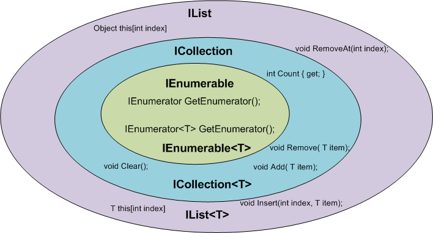
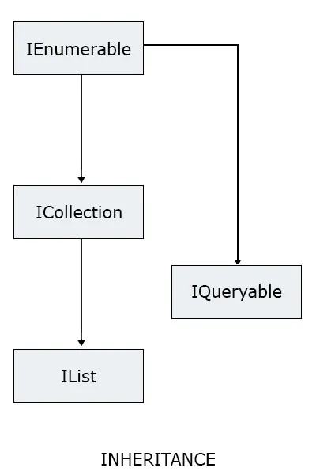

# IEnumberable, ICollection, IList, IQueryable,

### IEnumberable

An IEnumerable is a list or a container which can hold some items. You can iterate through each element in the IEnumerable. You can not edit the items like adding, deleting, updating, etc.

IEnumerator GetEnumerator();

### ICollection

ICollection is another type of collection, which derives from IEnumerable and extends it’s functionality to add, remove, update element in the list. ICollection also holds the count of elements in it and we does not need to iterate over all elements to get total number of elements.

int Count {get;} void Removed(T item); void Add(T item); void Clear(); 

### IList

IList extends ICollection. An IList can perform all operations combined from IEnumerable and ICollection, and some more operations like inserting or removing an element in the middle of a list.

You can use a foreach loop or a for loop to iterate over the elements.

### **IQueryable**

IQueryable extends ICollection. An IQueryable generates a LINQ to SQL expression that is executed over the database layer. Instead of the generating a Func<T, bool> like the ones above, IQueryable generates an expression tree and gives Expression<Func<T, bool>> that is executed over the database layer to get data set.

### IEnumerable vs List

The main difference between IEnumerable and List in C# is that IEnumerable is an interface, while List is a concrete class. Moreover, IEnumerable is read-only and List is not. List represents the entire collection in memory, while IEnumerable provides an interface for getting the next item one-by-one (enumerating data). 

Deferred execution - IEnumerable is a deferred execution while List is an immediate execution.

IEnumerable will not execute the query until you enumerate over the data, whereas List will execute the query as soon as it's called. Deferred execution makes IEnumerable faster because it only gets the data when needed.

### **Is IEnumerable faster than List?**

IEnumerable is conceptually faster than List because of the deferred execution. Deferred execution makes IEnumerable faster because it only gets the data when needed. Contrary to Lists having the data in-memory all the time.

### Principles and design pattern

> Take the most generic type, return the most specific type \
> It is good practice to use IEnumerable if no functionality of IList or List are required \
> Return the most specific type, accept the most generic type

It's better to use interfaces rather than concrete implementations because it gives the most flexibility.